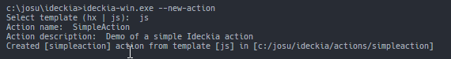
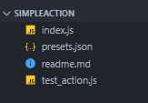

If you don't know what Ideckia is, I wrote an [introductory post](https://dev.to/josuigoa/open-source-streamdeck-alternative-1gf3).

To get some context, this is how the Ideckia server works:

* Read the `layout.json` file where all the items are defined (with their attatched actions).
* Initializes all the actions defined in that file injecting to each instance the properties defined for each case.

In this post we will create our very first Ideckia action, a simple parametrized action to update an item with a text, we will follow these steps:

* Create the JavaScript file with the Ideckia actions structure
* Add a property to that file to be configurable from the editor
* Configure the new action in the editor
* Add the code to be executed when the item is clicked.

As a proof of what easy (and fast) is to create an action for Ideckia: I've created the action itself, configured it in the editor, documented each step, took screenshots, write a basic post, some bugfixes in the server... and it took me **only 20 minutes**.

### Creation of the action files

If we haven't got Ideckia installed in our machine, we must download [Ideckia](https://ideckia.github.io) and uncompress it in a directory.

Ideckia gives us a command to create a very basic actions from templates, so let's tell it to create one!

* Open a terminal
* Go to where Ideckia executable is
* Execute the command `ideckia --new-action` (`ideckia.exe --new-action` in Windows)
* It will ask you for a few configurations to create the action:
  * What language do you want to create the action. Current options are Haxe or Javascript. For this example, I will pick JS because you don't have to have nothing spetial installed.
  * A name for the action
  * A brief description of what this actions does



Ideckia has just created a directory with the name of our new action inside of `actions` directory. Open that directory in your preferred editor and this is what that directory contains:



To have the action running, the only needed file is `index.js` actually. It follows the structure defined [here](https://github.com/ideckia/ideckia_api#action-structure)

```javascript
class Simpleaction {

    setup(props, server) {
        this.props = props == null ? {} : props;
        this.server = server;
    }

    init(initialState) {
        return new Promise((resolve, reject) => {
            resolve(initialState);
        });
    }

    execute(currentState) {
        throw 'Not implemented';
        // return new Promise((resolve, reject) => {
        // 		resolve(currentState);
        // });
    }

    onLongPress(currentState) {
        return new Promise((resolve, reject) => {
            resolve(currentState);
        });
    }

    getActionDescriptor() {
        return {
            name: "simpleaction",
            description: "Demo of a simple Ideckia action",
            // props : [{
            // 	name : "propertyName",
            // 	type : "String",
            // 	isShared : false,
            //	defaultValue: "default value",
            // 	description : "property description",
            // 	values : ["possible", "values", "for the property"]
            // }]
        };
    }
}

exports.IdeckiaAction = Simpleaction;
```

There are some other files, but they are helpers:

* `readme.md`: Who doesn't know what is that file for?
* `presets.json`: There will go some property definitions for common use cases. They will load to select in the editor.
* `test_action.js`: A JS file for loading and executing the `index.js` to be more agile when testing the action.

### Add a configurable property

As said in the first section, these properties are injected in the action instance when it is created so they can be accesible via `this.props` property. As we want to have a property called `name` to show in the item, in this case we will get the text from `this.props.name`.

To have this property configurable from the built-in editor, our action must tell the server that that property exists. When the editor is opened, the server asks to every action loaded some information about them: action name, description, properties... This communication is made by the `ActionDescriptor` element returned by the `getActionDescriptor()` function. With this information, the editor can build the UI for the configuration of every action. Update the `index.js` file and paste this piece of code.

```javascript
getActionDescriptor() {
    return {
        name: "simpleaction",
        description: "Demo of a simple Ideckia action",
        props: [{
            name: "name",
            type: "String",
            isShared: false,
            defaultValue: "Ideckia",
            description: "A name shown in the window",
            values: []
        }]
    };
}
```

### Configure the action

Now we must start the application (if it isn't already). When it is running, go to the [editor](http://localhost:8888/editor). We will add the action to the panel to test it. At this point it's convenient to be familiar with the [concepts used by Ideckia](https://github.com/ideckia/ideckia/wiki/Concepts)

Select an empty item


Add a state to the item. It will ask you to select between 'Change directory' or 'Multi State'. We will selecte the second one.


(Optional) Select the state element and edit it: text, text color, background color, icon, text size...


Add an action to the state


Select our action from the actions list


Set the property of our action


Click the `Update server layout` button to save the changes.

### Change the code

Ok, our action is configured in the layout. But, what will this action do?

Is time to use the property and update the item. When the item is clicked in the client, the function `execute(currentState)` of the action is executed. It will return a Promise with the state to show in the item. The state has these properties:

```javascript
ItemState = {
    text
    textSize
    textColor
    textPosition
    icon
    bgColor
}
```

We will change the `text` property of the incoming state to add the current timestamp and show an information dialog to the user showing the configured text. Replace the `index.js` `execute` function by this block:

```javascript
execute(currentState) {
    return new Promise((resolve, reject) => {
        currentState.text = `Clicked at ${Date.now()}`;
        this.server.dialog.info('Extra! Extra!', `A simple hello from a simple action! My name is [${this.props.name}]!`);
        resolve(currentState);
    });
}
```

### Time to test

Open an Ideckia client ([mobile](https://github.com/ideckia/mobile_client/releases/latest), [desktop](https://github.com/josuigoa/ideckia_client/releases/latest)). If you don't have any of these, the [editor](http://localhost:8888/editor) can be used as client checking the checkbox in the top right corner. Once it is selected, any click on an item will be considered a click in a client, triggering the action in the server.

So, click the item in any (or every!) client connected to the server _et voilà!_ The item text will show the current timestamp and a info dialog box will pop up in your screen.


[Here](https://github.com/josuigoa/simpleaction) is the entire code of this project