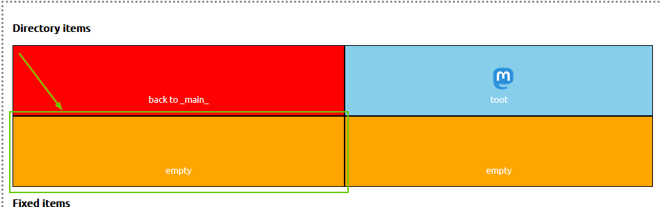
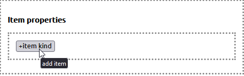
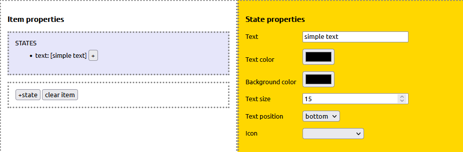
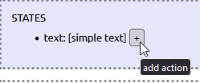
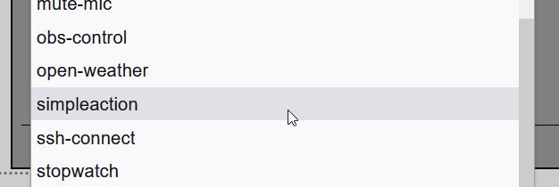
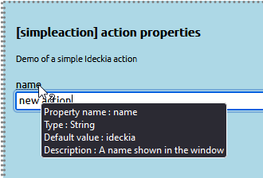
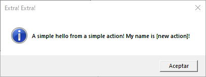

If you don't know what Ideckia is, I wrote an [introductory post](https://dev.to/josuigoa/open-source-streamdeck-alternative-1gf3).

To get some context, this is how the Ideckia server works:

* Read the `layout.json` file where all the items are defined (with their attached actions).
* Initializes all the actions defined in that file and injects to action each instance the properties defined for each case.

In this post we will create our very first Ideckia action, a simple parametrized action to update an item with a text, we will follow these steps:

* Create the JavaScript file with the Ideckia actions structure
* Configure the new action in the editor.
* Check it is working as expected

As a proof of what easy (and fast) is to create an action for Ideckia: I've created the action itself, configured it in the editor, documented each step, took screenshots, write a basic post, some bugfixes in the server... and it took me **only 10 minutes**.

### Creation of the action file

If we haven't Ideckia in our machine, we must [download](https://ideckia.github.io) and uncompress it in a directory.

Go to the `actions` directory and create a new directory called `simpleaction` (or the name you prefer, is your action!). Inside that directory create a file called `index.js`, this name is mandatory, so you can't pick another one, sorry.

Paste this code in the `index.js` file.

```javascript
class SimpleAction {

    // Method called to inject the properties and server access (dialogs, logs...)
    setup(props, server) {
        this.props = props == null ? {} : props;
        if (this.props.name == null) {
            this.props.name = 'Ideckia';
        }
        this.server = server;
    }

    // Method called when the action is loaded
    init(initialState) {
        return new Promise((resolve, reject) => {
            resolve(initialState);
        });
    }

    // Method called when the item is clicked in the client
    execute(currentState) {
        return new Promise((resolve, reject) => {
            currentState.text = `Clicked at ${Date.now()}`;
            this.server.dialog.info('Extra! Extra!', `A simple hello from a simple action! My name is [${this.props.name}]!`);
            resolve(currentState);
        });
    }

    // Method called when the item is long pressed in the client
    onLongPress(currentState) {
        return new Promise((resolve, reject) => {
            resolve(currentState);
        });
    }

    // Method called from the editor to create an UI to configure the action
    getActionDescriptor() {
        return {
            name: "simpleaction",
            description: "Demo of a simple Ideckia action",
            props: [{
                name: "name",
                type: "String",
                isShared: false,
                defaultValue: "Ideckia",
                description: "A name shown in the window",
                values: []
            }]
        };
    }
}

exports.IdeckiaAction = SimpleAction;
```
### Explanation

There are two methods that needs to be explained: `execute` and `getActionDescriptor`.

* `execute`: This method is called when the item is clicked in the client. The code we put in there will do this:
  * Update the text of the client item.
  * Show up a information dialog box with the given text. The text is the property called `name`.
* `getActionDescriptor`: This method is called by the editor. It returns the properties that can be configured by the editor. In the example above, we've added the property `name`.


### Configure the action

Now we must start the application (if it isn't already). When it is running, go to the [editor](http://localhost:8888/editor). We will add the action to the panel to test it. At this point it's convenient to be familiar with the [concepts used by Ideckia](https://github.com/ideckia/ideckia/wiki/Concepts)

Select an empty item



Add a state to the item. It will ask you to select between 'Change directory' or 'Multi State'. We will selecte the second one.



(Optional) Select the state element and edit it: text, text color, background color, icon, text size...



Add an action to the state



Select our action from the actions list



Set the property of our action



Click the `Update server layout` button to save the changes.

### Time to test

Be sure you have Ideckia running. Open an Ideckia client ([mobile](https://github.com/ideckia/mobile_client/releases/latest), [desktop](https://github.com/josuigoa/ideckia_client/releases/latest)). If you don't have any of these, the [editor](http://localhost:8888/editor) can be used as client checking the checkbox in the top right corner. Once it is selected, any click on an item will be considered a click in a client, triggering the action in the server.

So, click the item in any (or every!) client connected to the server _et voilà!_ The item text will show the current timestamp and a info dialog box will pop up in your screen.



[Here](https://github.com/josuigoa/simpleaction) is the entire code of this project

### Change the code and play with it

Ok, you've seen what is going on. Now it is time to tinker with the new action. What will happen if you...

* Add a new property to change the title of the dialog box?
* Change the background color of the item when it is clicked?

Remember that the state of the item has this structure:

```javascript
ItemState = {
    text
    textSize
    textColor
    textPosition
    icon
    bgColor
}
```

Have fun!
